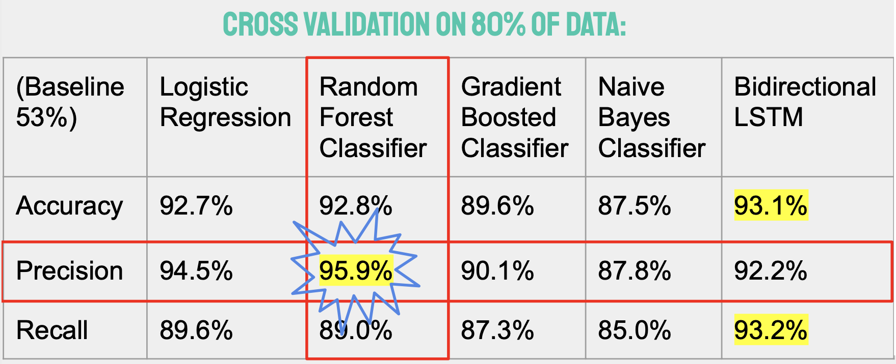
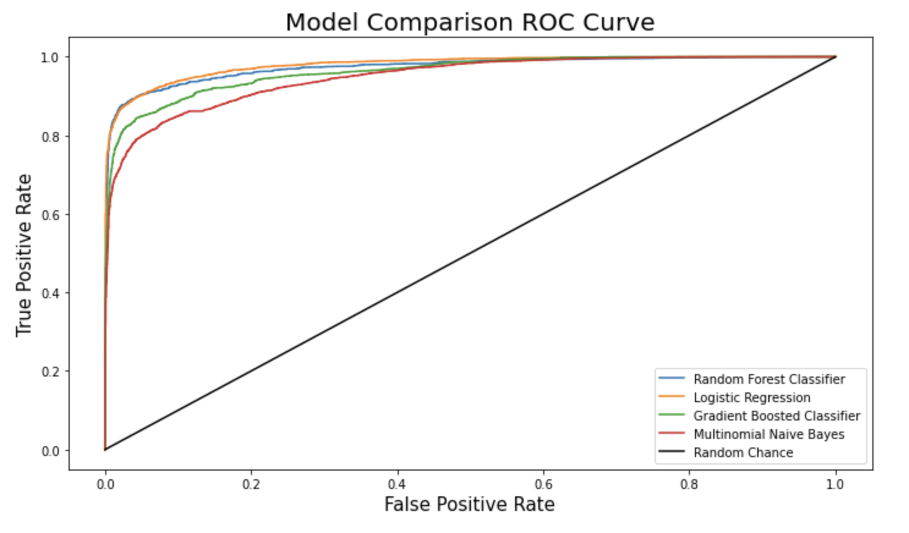
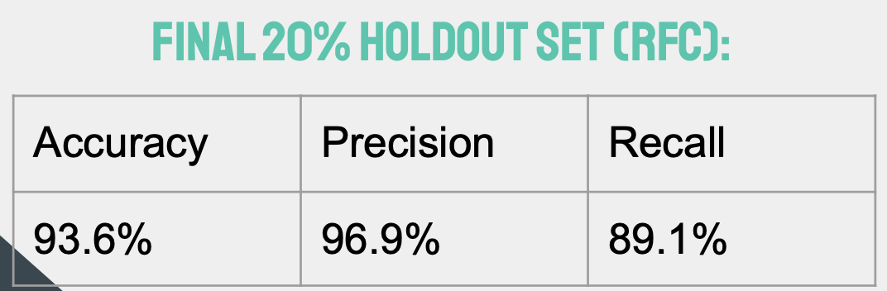
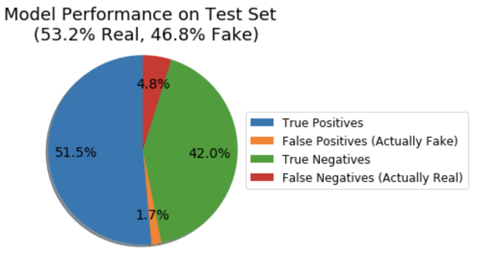
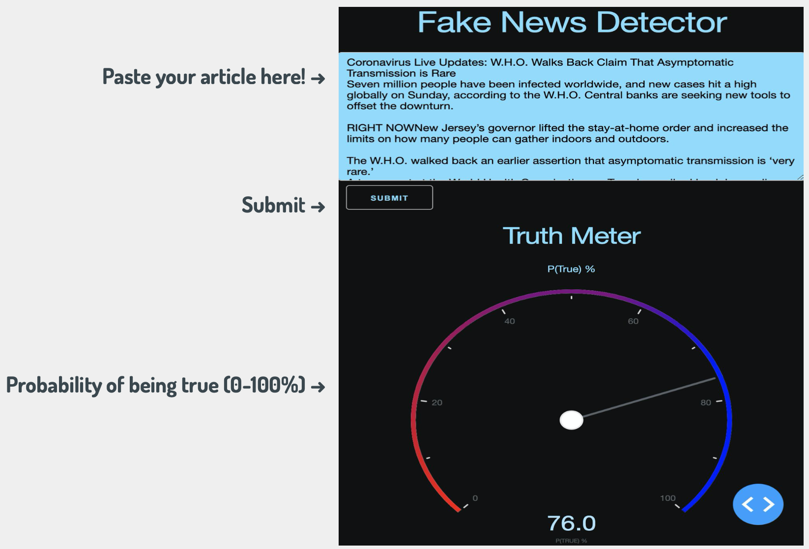

# Fake News Detector
**Using Modern Machine Learning Techniques to Identify False Information in Political News Articles** 
by Benjamin Karlsberg 

### Table of Contents

* [Background](#background)
* [Data](#data)
* [Model Testing](#models)
* [Results](#results)
* [Dash Web App](#app)
* [Conclusion](#conclusion)

## Background

### What is “Fake” News?
In a broad sense, “fake” news contains information that is false or exaggerated beyond objective facts. Fake news articles tend to contain language that is opinionated and biased towards one viewpoint in order to promote a political agenda or to generate views for advertising.

### How the Detector Works
By honing in on the language that tends to be used in “real” and “fake” news articles, the detector is able to calculate the probability of the article being from a factual source. 
*Note: this does not imply that the detector verifies actual claims in the articles. It primarily suspects the article of being biased or not.

## Data

The data that was used to train the model contains over 70,000 labeled articles that were sourced from “Politifact.com” (80%), “The New York Times” (10%), and “The Onion Magazine (10%).” 47% of the articles were labeled as “fake” and 53% as “true.”

[IEEEDataport - Fake News Data](https://ieee-dataport.org/documents/fake-news-data)

[Kaggle - Fake and Real](https://www.kaggle.com/clmentbisaillon/fake-and-real-news-dataset?select=True.csv)

[Kaggle - Onion or Not](https://www.kaggle.com/chrisfilo/onion-or-not?select=OnionOrNot.csv)

[Kaggle - All the News](https://www.kaggle.com/snapcrack/all-the-news?select=articles1.csv)

## Model Testing

The data was organized for Natural Language Processing using a TF-IDF vector which:
  * Lemmatized words to avoid duplications
  * Included trigrams and bigrams to add context
  * Was capped at a 20,000 feature limit of the most important features

Five different models were compared and cross-validated to determine the Accuracy, Precision, and Recall metrics. 80% of the total data was used as a training set while the remaining 20% was used to test the final model. The final model (Random Forest Classifier) was decided based on the best Precision score (correctly predicted positive examples / total number of positive examples that were predicted) to get as few false positives as possible. False positive results would mean the model miscalculated a false article as true and a true article as false.

## Results

Below are the results of the Random Forest Classifier model on the final holdout test data:

## Dash Web App

A simple application using Dash is included as a way of utilizing the model for any user with an interface:

## Conclusion

Although this model is shown to be quite accuracte given the data it was trained on, please keep in mind that this model does not do any sort of fact-checking. It is a pure NLP classifier model that attempts to link certain words or phrases to false or positive information. Do not use this model as a single source of due dilligence.

Please view the PowerPoint PDF or the Overview PDF for a condensed summary of this project as well as a list of technologies used.
